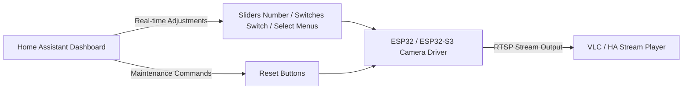

# 🎥 ESP32-CAM / ESP32-S3-CAM RTSP Streaming Server for ESPHome

<p align="center">
  
  
  
  
</p>

> **Language / 語言切換**: **English (README.md)** | [繁體中文 (README_zht.md)](README_zht.md)

A versatile RTSP streaming server external component designed for **ESPHome (2025.7.0 and later)**. A unified codebase seamlessly supports both **ESP32-CAM** and **ESP32-S3-CAM** development boards across both **Arduino** and **ESP-IDF** frameworks. It provides a comprehensive Home Assistant dashboard control panel (sliders, switches, dropdowns) and camera soft/hard reset buttons, making real-time image tuning straightforward and convenient!

---

## 📑 Table of Contents

- [✨ Features & Highlights](#-features--highlights)
- [🗂️ File & Directory Structure](#️-file--directory-structure)
- [🚀 Quick Start](#-quick-start)
  - [Step 1: Copy Component Directories](#step-1-copy-component-directories)
  - [Step 2: Configure External Components and YAML](#step-2-configure-external-components-and-yaml)
- [⚙️ Camera & RTSP Configuration Options](#️-camera--rtsp-configuration-options)
  - [Supported Resolutions](#supported-resolutions)
- [🎛️ Home Assistant Entity Controls & Reset Buttons](#️-home-assistant-entity-controls--reset-buttons)
  - [Comparison of the Four Reset / Restart Buttons](#comparison-of-the-four-reset--restart-buttons)
- [📺 RTSP Stream Playback & Verification](#-rtsp-stream-playback--verification)
- [📄 Full YAML Configuration Examples](#-full-yaml-configuration-examples)
- [💡 Notes & Troubleshooting](#-notes--troubleshooting)
- [🙏 Credits & References](#-credits--references)

---

## ✨ Features & Highlights

- 🤖 **AI-Assisted Architecture Refinement**: Refined and optimized with the assistance of Antigravity AI (Gemini 3.7 Flash).
- 🔄 **Universal Dual-Chip & Dual-Framework Compatibility**: A single codebase supports both **Arduino** and **ESP-IDF** frameworks across **ESP32-CAM** and **ESP32-S3-CAM**.
- 💡 **Flexible Illumination Light Control**: Easily add support for on-board ultra-bright white LEDs (GPIO Switch) or WS2812B RGB LEDs (Light Strip).
- 🎛️ **Full Real-time Home Assistant Dashboard Control**:
  - Live adjustment of Brightness, Contrast, Saturation, Exposure (AEC/AE Level), Gain (AGC), etc. via Number sliders.
  - Live dropdown selection for Special Effects, White Balance Modes, and Gain Ceilings.
  - Instant hardware toggles for Horizontal Mirror, Vertical Flip, Lens Correction, DCW Denoising, etc.
  - **Dynamic Resolution Switching**: Change camera resolution on-the-fly directly from Home Assistant without recompiling or rebooting.
- 🔒 **Factory Defaults Protection**: Preserves firmware-flashed default values for one-click restoration.
- 🔘 **Four-Tier Camera & System Maintenance Buttons**:
  1. **Reset to Factory Defaults**: Restores all camera parameters to initial YAML values without interrupting the RTSP stream.
  2. **Restart Camera**: Resets the sensor registers while preserving current dashboard settings without interrupting the stream.
  3. **Cold Restart Camera**: Cycles power to the camera hardware module (with customizable discharge delay) while preserving current settings without interrupting the stream.
  4. **Restart Device**: Reboots the entire ESP32 system.

---

## 🗂️ File & Directory Structure

```text
├── components/
│   ├── esp32cam_rtsp_server/            # RTSP server main component (ESPHome external component)
│   └── micro_rtsp/                      # Lightweight RTSP low-level library
├── example-ha-esp32-(s3)-cam.yaml       # Full YAML configuration example (English comments)
├── example-ha-esp32-(s3)-cam_zht.yaml   # Full YAML configuration example (Traditional Chinese comments)
├── README.md                            # English documentation
└── README_zht.md                        # Traditional Chinese documentation
```

---

## 🚀 Quick Start

### Step 1: Copy Component Directories

Copy the `components` folder (containing `esp32cam_rtsp_server` and `micro_rtsp`) into your ESPHome project directory:

```text
your-esphome-folder/
├── components/
│   ├── esp32cam_rtsp_server/
│   └── micro_rtsp/
└── your_camera.yaml
```

### Step 2: Configure External Components and YAML

Add `external_components` and `includes` to the top of your YAML file:

```yaml
esphome:
  name: ha-esp32-cam
  friendly_name: "HA ESP32 Camera"
  includes:
    - components/micro_rtsp

external_components:
  - source: components

# For ESP32-S3-CAM, explicitly configuring the PSRAM mode is strongly recommended
psram:
  mode: octal
  speed: 80MHZ

esp32:
  board: esp32-s3-devkitc-1 # Set according to your board model
  variant: ESP32S3
  framework:
    type: esp-idf           # Supports esp-idf or arduino
```

---

## ⚙️ Camera & RTSP Configuration Options

Configure the `esp32cam_rtsp_server` section in your YAML:

```yaml
esp32cam_rtsp_server:
  id: rtsp_camera                       # Component ID for entity binding (Optional)
  camera: esp32cam_aithinker            # Camera pinout model (Optional, defaults to board preset)
  port: 554                             # RTSP port (Optional, default: 554)
  max_framerate: 10 fps                 # Max FPS (Optional, default: 5 fps, range: 1 - 60)
  resolution: VGA                       # Initial resolution (Optional, default: VGA)
  external_clock_frequency: 20000000    # XCLK frequency (Optional, default: 20MHz)
  brightness: 0                         # Brightness (-2 to 2)
  contrast: 0                           # Contrast (-2 to 2)
  saturation: 0                         # Saturation (-2 to 2)
  special_effect: none                  # Effects: none, negative, grayscale, red_tint, green_tint, blue_tint, sepia
  white_balance: true                   # Auto white balance (true / false)
  wb_mode: auto                         # White balance mode: auto, sunny, cloudy, office, home
  exposure_control: true                # Auto exposure control (true / false)
  ae_level: 0                           # AE Level (-2 to 2)
  aec_value: 300                        # Manual exposure value (0 to 1200)
  gain_control: false                   # Auto gain control (true / false)
  agc_gain: 6                           # Gain value (0 to 30)
  gain_ceiling: 2x                      # Gain ceiling: 2x, 4x, 8x, 16x, 32x, 64x, 128x
  horizontal_mirror: false              # Horizontal mirror (true / false)
  vertical_flip: false                  # Vertical flip (true / false)
```

### Supported Resolutions

| Code | Resolution | Code | Resolution |
| :--- | :--- | :--- | :--- |
| **UXGA** | 1600 × 1200 | **CIF** | 400 × 296 |
| **SXGA** | 1280 × 1024 | **QVGA** | 320 × 240 |
| **HD** | 1280 × 720 | **240X240** | 240 × 240 |
| **XGA** | 1024 × 768 | **HQVGA** | 240 × 176 |
| **SVGA** | 800 × 600 | **QCIF** | 176 × 144 |
| **HVGA** | 480 × 320 | **QQVGA** | 160 × 120 |
| **VGA** *(Default)* | 640 × 480 | | |

---

## 🎛️ Home Assistant Entity Controls & Reset Buttons

This project maps the camera's low-level registers directly into standard ESPHome entities for live control within Home Assistant:

<p align="center">
  
  <br>
  <em>Home Assistant live parameter adjustment dashboard (including sliders, dropdowns, switches, and reset buttons)</em>
</p>



### Comparison of the Four Reset / Restart Buttons

| Button Name | Action Level | Active Settings | Stream Connection | Best Use Case |
| :--- | :--- | :--- | :--- | :--- |
| 🔄 **Reset to Factory Defaults** | Parameter Level | **Restored** to YAML defaults | 🟢 **Uninterrupted** | When settings become messy and you want to revert to defaults |
| 🔁 **Restart Camera** | Sensor Registers | **Preserved** as currently set | 🟢 **Uninterrupted** | Quick reset when image glitches or register anomalies occur |
| ⚡ **Cold Restart Camera** | Camera Module Power | **Preserved** as currently set | 🟢 **Uninterrupted** | Hardware power-cycle when sensor becomes unresponsive |
| 🔌 **Restart Device** | Entire System MCU | Reloaded from boot defaults | 🔴 **Interrupted & Reconnects** | Full device MCU reboot |

---

## 📺 RTSP Stream Playback & Verification

1. **Obtain Device IP Address**: Check the ESPHome logs or your router's DHCP client list (e.g. `192.168.1.100`).
2. **Test with VLC Media Player**:
   - Open VLC media player.
   - Select `Media` -> `Open Network Stream` (`Ctrl + N`).
   - Enter the URL:
     ```text
     rtsp://192.168.1.100:554/mjpeg/1
     ```
   - Click **Play** to start live preview.
3. **Home Assistant Integration**:
   - Integrate using the **Generic Camera** integration, or pair with **WebRTC Camera (go2rtc)** for ultra-low latency playback.

---

## 📄 Full YAML Configuration Examples

Ready-to-use configuration examples are included:
- English comments: [`example-ha-esp32-(s3)-cam.yaml`](example-ha-esp32-(s3)-cam.yaml)
- Traditional Chinese comments: [`example-ha-esp32-(s3)-cam_zht.yaml`](example-ha-esp32-(s3)-cam_zht.yaml)

<details>
<summary><b>Click to expand full example YAML structure</b></summary>

```yaml
esphome:
  name: ha-esp32-cam
  friendly_name: "HA ESP32 Camera"
  includes:
    - components/micro_rtsp
  # Automatically synchronize factory defaults to Home Assistant dashboard after 2s delay
  on_boot:
    priority: -200
    then:
      - delay: 2s
      - lambda: |-
          ESP_LOGI("camera_control", "Boot sync: publishing factory defaults to entities...");
          auto &fd = id(rtsp_camera).get_factory_defaults();
          id(cam_brightness).publish_state(fd.brightness);
          id(cam_contrast).publish_state(fd.contrast);
          id(cam_saturation).publish_state(fd.saturation);
          id(cam_ae_level).publish_state(fd.ae_level);
          id(cam_aec_value).publish_state(fd.aec_value);
          id(cam_agc_gain).publish_state(fd.agc_gain);

          const char* fx_names[] = {"None", "Negative", "Grayscale", "Red Tint", "Green Tint", "Blue Tint", "Sepia"};
          if (fd.special_effect >= 0 && fd.special_effect <= 6) {
            id(cam_special_effect).publish_state(fx_names[fd.special_effect]);
          }

          const char* wb_names[] = {"Auto", "Sunny", "Cloudy", "Office", "Home"};
          if (fd.wb_mode >= 0 && fd.wb_mode <= 4) {
            id(cam_wb_mode).publish_state(wb_names[fd.wb_mode]);
          }

          const char* gc_names[] = {"2X", "4X", "8X", "16X", "32X", "64X", "128X"};
          if (fd.gainceiling >= 0 && fd.gainceiling <= 6) {
            id(cam_gainceiling).publish_state(gc_names[fd.gainceiling]);
          }

          id(cam_hmirror).publish_state(fd.hmirror != 0);
          id(cam_vflip).publish_state(fd.vflip != 0);
          id(cam_whitebal).publish_state(fd.whitebal != 0);
          id(cam_awb_gain).publish_state(fd.awb_gain != 0);
          id(cam_exposure_ctrl).publish_state(fd.exposure_ctrl != 0);
          id(cam_aec2).publish_state(fd.aec2 != 0);
          id(cam_gain_ctrl).publish_state(fd.gain_ctrl != 0);
          id(cam_bpc).publish_state(fd.bpc != 0);
          id(cam_wpc).publish_state(fd.wpc != 0);
          id(cam_raw_gma).publish_state(fd.raw_gma != 0);
          id(cam_lenc).publish_state(fd.lenc != 0);
          id(cam_dcw).publish_state(fd.dcw != 0);
          id(cam_colorbar).publish_state(false);
          id(cam_resolution).publish_state(id(rtsp_camera).get_resolution_name(fd.framesize));

external_components:
  - source: components

psram:
  mode: octal
  speed: 80MHZ

esp32:
  variant: ESP32S3
  framework:
    type: esp-idf

logger:

api:
  encryption:
    key: "YOUR_API_ENCRYPTION_KEY"
  on_client_connected:
    - lambda: |-
        ESP_LOGI("camera_control", "HA connected: synchronizing camera factory defaults to dashboard...");
        auto &fd = id(rtsp_camera).get_factory_defaults();
        id(cam_brightness).publish_state(fd.brightness);
        id(cam_contrast).publish_state(fd.contrast);
        id(cam_saturation).publish_state(fd.saturation);
        id(cam_ae_level).publish_state(fd.ae_level);
        id(cam_aec_value).publish_state(fd.aec_value);
        id(cam_agc_gain).publish_state(fd.agc_gain);

        const char* fx_names[] = {"None", "Negative", "Grayscale", "Red Tint", "Green Tint", "Blue Tint", "Sepia"};
        if (fd.special_effect >= 0 && fd.special_effect <= 6) {
          id(cam_special_effect).publish_state(fx_names[fd.special_effect]);
        }

        const char* wb_names[] = {"Auto", "Sunny", "Cloudy", "Office", "Home"};
        if (fd.wb_mode >= 0 && fd.wb_mode <= 4) {
          id(cam_wb_mode).publish_state(wb_names[fd.wb_mode]);
        }

        const char* gc_names[] = {"2X", "4X", "8X", "16X", "32X", "64X", "128X"};
        if (fd.gainceiling >= 0 && fd.gainceiling <= 6) {
          id(cam_gainceiling).publish_state(gc_names[fd.gainceiling]);
        }

        id(cam_hmirror).publish_state(fd.hmirror != 0);
        id(cam_vflip).publish_state(fd.vflip != 0);
        id(cam_whitebal).publish_state(fd.whitebal != 0);
        id(cam_awb_gain).publish_state(fd.awb_gain != 0);
        id(cam_exposure_ctrl).publish_state(fd.exposure_ctrl != 0);
        id(cam_aec2).publish_state(fd.aec2 != 0);
        id(cam_gain_ctrl).publish_state(fd.gain_ctrl != 0);
        id(cam_bpc).publish_state(fd.bpc != 0);
        id(cam_wpc).publish_state(fd.wpc != 0);
        id(cam_raw_gma).publish_state(fd.raw_gma != 0);
        id(cam_lenc).publish_state(fd.lenc != 0);
        id(cam_dcw).publish_state(fd.dcw != 0);
        id(cam_colorbar).publish_state(false);
        id(cam_resolution).publish_state(id(rtsp_camera).get_resolution_name(fd.framesize));

ota:
  - platform: esphome
    password: "YOUR_OTA_PASSWORD"

wifi:
  ssid: "YOUR_WIFI_SSID"
  password: "YOUR_WIFI_PASSWORD"

esp32cam_rtsp_server:
  id: rtsp_camera
  camera: esp32cam_aithinker
  external_clock_frequency: 20000000
  max_framerate: 5 fps
  port: 554
  resolution: VGA
  brightness: 0
  contrast: 0
  saturation: 0
  special_effect: none
  white_balance: true
  awb_gain: true
  wb_mode: auto
  exposure_control: true
  aec2: true
  ae_level: 0
  aec_value: 300
  gain_control: false
  agc_gain: 6
  gain_ceiling: 2x
  bpc: false
  wpc: true
  raw_gma: true
  horizontal_mirror: false
  vertical_flip: false 
  lenc: true
  dcw: true

# For full entity configurations, please see example-ha-esp32-(s3)-cam.yaml
```

</details>

---

## 💡 Notes & Troubleshooting

> [!TIP]
> **Onboard LED Flashlight Configuration**:
> - If using **ESP32-CAM**: Uncomment the `LED Flashlight` section under the `switch:` block (GPIO LED switch) to enable onboard flash control.
> - If using **ESP32-S3-CAM**: Uncomment the `LED Flashlight` section under the `light:` block (WS2812B RGB light strip) to enable onboard light control.

> [!TIP]
> **PSRAM Configuration**: ESP32-CAM typically loads PSRAM automatically. If using an ESP32-S3-CAM, it is strongly recommended to explicitly configure the `psram:` block in your YAML (e.g., `mode: octal`, `speed: 80MHZ`) for optimal performance and stability.

> [!NOTE]
> **TTGO T-Camera Notice**: The codebase includes TTGO T-Camera pin definitions; however, due to hardware revisions, please verify pinouts based on your specific board version.

> [!WARNING]
> **Resolution vs. Framerate**: Higher resolutions (e.g., SXGA, UXGA) at high framerates consume significant PSRAM bandwidth and Wi-Fi throughput. Adjust `max_framerate` according to your network and use-case.

---

## 🙏 Credits & References

- **Micro-RTSP**: <https://github.com/geeksville/Micro-RTSP>
- **esp32cam-rtsp**: <https://github.com/rzeldent/esp32cam-rtsp>
- **ESP32-CAM OV2640 Camera Settings**: [Random Nerd Tutorials](https://randomnerdtutorials.com/esp32-cam-ov2640-camera-settings/)
