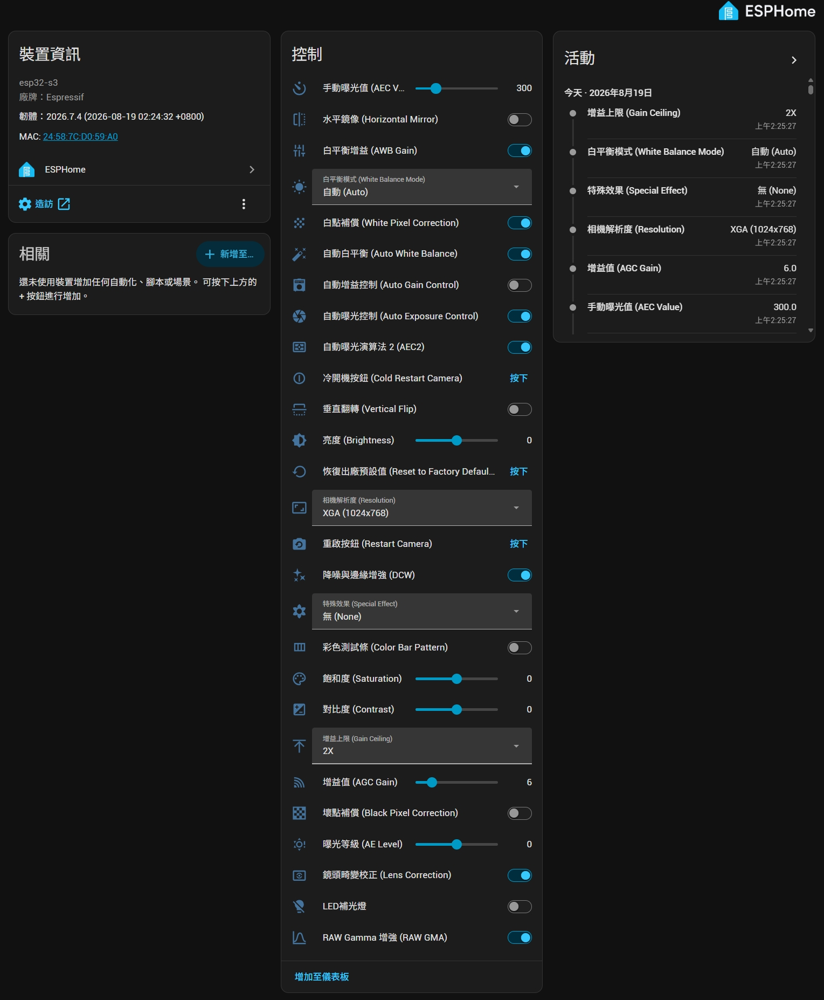
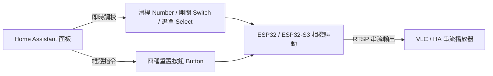

# 🎥 ESP32-CAM / ESP32-S3-CAM RTSP 串流伺服器 for ESPHome

<p align="center">
  
  
  
  
</p>

> **語言切換 / Language**: [English (README.md)](README.md) | **繁體中文 (README_zht.md)**

專為 **ESPHome (2025.7.0 及後續版本)** 設計的 RTSP 串流伺服器外部元件，單一程式碼庫完美相容 **ESP32-CAM** 與 **ESP32-S3-CAM** 開發板，並支援 **Arduino** 與 **ESP-IDF** 雙開發框架。提供 Home Assistant 完整的即時參數調節面板（滑桿、開關、下拉選單）以及相機軟硬體重置按鈕，讓影像調校更即時便利！

---

## 📑 目錄

- [✨ 新版程式特色](#-新版程式特色)
- [🗂️ 檔案與目錄結構](#️-檔案與目錄結構)
- [🚀 快速上手](#-快速上手)
  - [步驟 1：複製元件目錄](#步驟-1複製元件目錄)
  - [步驟 2：引入外部元件與相機設定](#步驟-2引入外部元件與相機設定)
- [⚙️ 相機與 RTSP 參數設定說明](#️-相機與-rtsp-參數設定說明)
  - [解析度支援列表](#解析度支援列表)
- [🎛️ Home Assistant 實體控制與重置按鈕](#️-home-assistant-實體控制與重置按鈕)
  - [四種重置 / 重啟按鈕功能比較](#四種重置--重啟按鈕功能比較)
- [📺 RTSP 串流播放與驗證](#-rtsp-串流播放與驗證)
- [📄 完整 YAML 設定檔範例](#-完整-yaml-設定檔範例)
- [💡 注意事項與疑難排解](#-注意事項與疑難排解)
- [🙏 程式來源與參考資料](#-程式來源與參考資料)

---

## ✨ 新版程式特色

- 🤖 **AI 輔助重構**：程式架構藉由 Antigravity AI (Gemini 3.7 Flash) 深度調校與優化。
- 🔄 **雙晶片、雙框架通用**：同一套程式庫同時相容於 **Arduino** 與 **ESP-IDF** 框架，無縫支援 ESP32-CAM 及 ESP32-S3-CAM。
- 💡 **補光燈模組彈性擴充**：支援超亮白光 LED（GPIO Switch）或 WS2812B RGB 補光燈（Light Strip）。
- 🎛️ **Home Assistant 深度即時互動**：
  - 亮度、對比度、飽和度、曝光值（AEC/AE Level）、增益值（AGC）等滑桿即時調節。
  - 特殊色彩效果、白平衡模式、增益上限即時下拉切換。
  - 水平鏡像、垂直翻轉、畸變校正、降噪邊緣增強等多項硬體開關控制。
  - **即時切換解析度**：無需重新燒錄或重啟設備，直接於 HA 介面動態切換相機解析度。
- 🔒 **出廠預設值保護 (Factory Defaults)**：保留初始燒錄參數，一鍵還原不迷失。
- 🔘 **四重相機與系統維護按鈕**：
  1. **恢復出廠預設值 (Reset to Factory Defaults)**：參數回到 YAML 燒錄設定，串流不中斷。
  2. **重啟相機 (Restart Camera)**：重置感測器暫存器，保留當前設定，串流不中斷。
  3. **冷開機按鈕 (Cold Restart Camera)**：相機模組硬體斷電重啟（支援自訂放電時間），保留當前設定，串流不中斷。
  4. **ESP32 設備重開機 (Restart Device)**：整機系統重啟。

---

## 🗂️ 檔案與目錄結構

```text
├── components/
│   ├── esp32cam_rtsp_server/            # RTSP 伺服器主元件 (ESPHome 外部元件)
│   └── micro_rtsp/                      # 輕量化 RTSP 底層函式庫
├── example-ha-esp32-(s3)-cam.yaml       # 英文註解之完整 YAML 設定範例
├── example-ha-esp32-(s3)-cam_zht.yaml   # 繁體中文註解之完整 YAML 設定範例
├── README.md                            # 英文說明文件 (English)
└── README_zht.md                        # 繁體中文說明文件 (中文版)
```

---

## 🚀 快速上手

### 步驟 1：複製元件目錄

將專案中的 `components` 資料夾（內含 `esp32cam_rtsp_server` 與 `micro_rtsp`）複製到您的 ESPHome 專案目錄下：

```text
your-esphome-folder/
├── components/
│   ├── esp32cam_rtsp_server/
│   └── micro_rtsp/
└── your_camera.yaml
```

### 步驟 2：引入外部元件與相機設定

在您的 YAML 檔案頂部加入 `external_components` 與 `includes`：

```yaml
esphome:
  name: ha-esp32-cam
  friendly_name: "HA ESP32 相機"
  includes:
    - components/micro_rtsp

external_components:
  - source: components

# 若使用 ESP32-S3-CAM，建議明確指定 PSRAM 模式
psram:
  mode: octal
  speed: 80MHZ

esp32:
  board: esp32-s3-devkitc-1 # 依您的開發板型號填寫
  variant: ESP32S3
  framework:
    type: esp-idf           # 支援 esp-idf 或 arduino
```

---

## ⚙️ 相機與 RTSP 參數設定說明

在 YAML 中定義 `esp32cam_rtsp_server` 區塊：

```yaml
esp32cam_rtsp_server:
  id: rtsp_camera                       # 元件 ID，用於 HA 實體連動（可選）
  camera: esp32cam_aithinker            # 相機類型（可選，預設依板子設定）
  port: 554                             # RTSP 連接埠（可選，預設 554）
  max_framerate: 10 fps                 # 最大幀率（可選，預設 5 fps，範圍: 1 - 60）
  resolution: VGA                       # 初始解析度（可選，預設 VGA）
  external_clock_frequency: 20000000    # XCLK 頻率（可選，預設 20MHz）
  brightness: 0                         # 亮度 (-2 ~ 2)
  contrast: 0                           # 對比度 (-2 ~ 2)
  saturation: 0                         # 飽和度 (-2 ~ 2)
  special_effect: none                  # 特效: none, negative, grayscale, red_tint, green_tint, blue_tint, sepia
  white_balance: true                   # 自動白平衡 (true / false)
  wb_mode: auto                         # 白平衡模式: auto, sunny, cloudy, office, home
  exposure_control: true                # 自動曝光 (true / false)
  ae_level: 0                           # 曝光等級 (-2 ~ 2)
  aec_value: 300                        # 手動曝光值 (0 ~ 1200)
  gain_control: false                   # 自動增益 (true / false)
  agc_gain: 6                           # 增益值 (0 ~ 30)
  gain_ceiling: 2x                      # 增益上限: 2x, 4x, 8x, 16x, 32x, 64x, 128x
  horizontal_mirror: false              # 水平鏡像 (true / false)
  vertical_flip: false                  # 垂直翻轉 (true / false)
```

### 解析度支援列表

| 代號 | 解析度大小 | 代號 | 解析度大小 |
| :--- | :--- | :--- | :--- |
| **UXGA** | 1600 × 1200 | **CIF** | 400 × 296 |
| **SXGA** | 1280 × 1024 | **QVGA** | 320 × 240 |
| **HD** | 1280 × 720 | **240X240** | 240 × 240 |
| **XGA** | 1024 × 768 | **HQVGA** | 240 × 176 |
| **SVGA** | 800 × 600 | **QCIF** | 176 × 144 |
| **HVGA** | 480 × 320 | **QQVGA** | 160 × 120 |
| **VGA** *(預設)* | 640 × 480 | | |

---

## 🎛️ Home Assistant 實體控制與重置按鈕

本專案將相機底層各項暫存器封裝為標準 ESPHome 實體，讓您在 Home Assistant Dashboard 上直接操作各項即時影像參數與維護指令：

<p align="center">
  
  <br>
  <em>Home Assistant 即時參數調節面板（包含滑桿、下拉選單、功能開關與重置按鈕）</em>
</p>



### 四種重置 / 重啟按鈕功能比較

| 按鈕名稱 | 作用層級 | 當前調校參數 | 串流連線狀態 | 適用情境 |
| :--- | :--- | :--- | :--- | :--- |
| 🔄 **恢復出廠預設值**<br>`Reset to Factory Defaults` | 參數層級 | **重置**為 YAML 初始值 | 🟢 **不中斷** | 調校參數混亂，欲一鍵回到初始狀態時 |
| 🔁 **相機重啟**<br>`Restart Camera` | 感測器暫存器 | **保持**當前面板設定 | 🟢 **不中斷** | 影像偶發雜訊或暫存器異常時快速重置 |
| ⚡ **相機冷開機**<br>`Cold Restart Camera` | 相機模組硬體電源 | **保持**當前面板設定 | 🟢 **不中斷** | 感測器硬體無響應或斷線時執行硬體斷電重啟 |
| 🔌 **ESP32 設備重開機**<br>`Restart Device` | 整機系統 MCU | 依開機設定載入 | 🔴 **中斷重連** | 系統層面重啟 |

---

## 📺 RTSP 串流播放與驗證

1. **取得設備 IP 位址**：檢視 ESPHome 日誌或路由器 DHCP 分配表取得 IP（例如：`192.168.1.100`）。
2. **VLC 播放器測試**：
   - 開啟 VLC 媒體播放器。
   - 點選 `媒體` -> `開啟網路串流` (Ctrl + N)。
   - 輸入 URL：
     ```text
     rtsp://192.168.1.100:554/mjpeg/1
     ```
   - 點擊「播放」即可即時預覽串流畫面。
3. **Home Assistant 整合**：
   - 使用 **Generic Camera** 整合或搭配 **WebRTC Camera (go2rtc)** 套件獲得極低延遲串流。

---

## 📄 完整 YAML 設定檔範例

專案提供開箱即用的完整設定檔，請參閱：
- 繁體中文註解版本：[`example-ha-esp32-(s3)-cam_zht.yaml`](example-ha-esp32-(s3)-cam_zht.yaml)
- 英文註解版本：[`example-ha-esp32-(s3)-cam.yaml`](example-ha-esp32-(s3)-cam.yaml)

<details>
<summary><b>點擊展開檢視完整範例 YAML 設定結構</b></summary>

```yaml
esphome:
  name: ha-esp32-cam
  friendly_name: "HA ESP32 Camera"
  includes:
    - components/micro_rtsp
  # 開機後延遲 2 秒自動同步相機預設參數至 Home Assistant 面板
  on_boot:
    priority: -200
    then:
      - delay: 2s
      - lambda: |-
          ESP_LOGI("camera_control", "開機自動同步出廠預設值至控制面板...");
          auto &fd = id(rtsp_camera).get_factory_defaults();
          id(cam_brightness).publish_state(fd.brightness);
          id(cam_contrast).publish_state(fd.contrast);
          id(cam_saturation).publish_state(fd.saturation);
          id(cam_ae_level).publish_state(fd.ae_level);
          id(cam_aec_value).publish_state(fd.aec_value);
          id(cam_agc_gain).publish_state(fd.agc_gain);

          const char* fx_names[] = {"無 (None)", "負片 (Negative)", "灰階 (Grayscale)", "紅調 (Red Tint)", "綠調 (Green Tint)", "藍調 (Blue Tint)", "復古 (Sepia)"};
          if (fd.special_effect >= 0 && fd.special_effect <= 6) {
            id(cam_special_effect).publish_state(fx_names[fd.special_effect]);
          }

          const char* wb_names[] = {"自動 (Auto)", "晴天 (Sunny)", "陰天 (Cloudy)", "辦公室 (Office)", "居家 (Home)"};
          if (fd.wb_mode >= 0 && fd.wb_mode <= 4) {
            id(cam_wb_mode).publish_state(wb_names[fd.wb_mode]);
          }

          const char* gc_names[] = {"2X", "4X", "8X", "16X", "32X", "64X", "128X"};
          if (fd.gainceiling >= 0 && fd.gainceiling <= 6) {
            id(cam_gainceiling).publish_state(gc_names[fd.gainceiling]);
          }

          id(cam_hmirror).publish_state(fd.hmirror != 0);
          id(cam_vflip).publish_state(fd.vflip != 0);
          id(cam_whitebal).publish_state(fd.whitebal != 0);
          id(cam_awb_gain).publish_state(fd.awb_gain != 0);
          id(cam_exposure_ctrl).publish_state(fd.exposure_ctrl != 0);
          id(cam_aec2).publish_state(fd.aec2 != 0);
          id(cam_gain_ctrl).publish_state(fd.gain_ctrl != 0);
          id(cam_bpc).publish_state(fd.bpc != 0);
          id(cam_wpc).publish_state(fd.wpc != 0);
          id(cam_raw_gma).publish_state(fd.raw_gma != 0);
          id(cam_lenc).publish_state(fd.lenc != 0);
          id(cam_dcw).publish_state(fd.dcw != 0);
          id(cam_colorbar).publish_state(false);
          id(cam_resolution).publish_state(id(rtsp_camera).get_resolution_name(fd.framesize));

external_components:
  - source: components

psram:
  mode: octal
  speed: 80MHZ

esp32:
  variant: ESP32S3
  framework:
    type: esp-idf

logger:

api:
  encryption:
    key: "YOUR_API_ENCRYPTION_KEY"
  on_client_connected:
    - lambda: |-
        ESP_LOGI("camera_control", "Home Assistant 連線建立，主動同步相機出廠預設值至控制面板...");
        auto &fd = id(rtsp_camera).get_factory_defaults();
        id(cam_brightness).publish_state(fd.brightness);
        id(cam_contrast).publish_state(fd.contrast);
        id(cam_saturation).publish_state(fd.saturation);
        id(cam_ae_level).publish_state(fd.ae_level);
        id(cam_aec_value).publish_state(fd.aec_value);
        id(cam_agc_gain).publish_state(fd.agc_gain);

        const char* fx_names[] = {"無 (None)", "負片 (Negative)", "灰階 (Grayscale)", "紅調 (Red Tint)", "綠調 (Green Tint)", "藍調 (Blue Tint)", "復古 (Sepia)"};
        if (fd.special_effect >= 0 && fd.special_effect <= 6) {
          id(cam_special_effect).publish_state(fx_names[fd.special_effect]);
        }

        const char* wb_names[] = {"自動 (Auto)", "晴天 (Sunny)", "陰天 (Cloudy)", "辦公室 (Office)", "居家 (Home)"};
        if (fd.wb_mode >= 0 && fd.wb_mode <= 4) {
          id(cam_wb_mode).publish_state(wb_names[fd.wb_mode]);
        }

        const char* gc_names[] = {"2X", "4X", "8X", "16X", "32X", "64X", "128X"};
        if (fd.gainceiling >= 0 && fd.gainceiling <= 6) {
          id(cam_gainceiling).publish_state(gc_names[fd.gainceiling]);
        }

        id(cam_hmirror).publish_state(fd.hmirror != 0);
        id(cam_vflip).publish_state(fd.vflip != 0);
        id(cam_whitebal).publish_state(fd.whitebal != 0);
        id(cam_awb_gain).publish_state(fd.awb_gain != 0);
        id(cam_exposure_ctrl).publish_state(fd.exposure_ctrl != 0);
        id(cam_aec2).publish_state(fd.aec2 != 0);
        id(cam_gain_ctrl).publish_state(fd.gain_ctrl != 0);
        id(cam_bpc).publish_state(fd.bpc != 0);
        id(cam_wpc).publish_state(fd.wpc != 0);
        id(cam_raw_gma).publish_state(fd.raw_gma != 0);
        id(cam_lenc).publish_state(fd.lenc != 0);
        id(cam_dcw).publish_state(fd.dcw != 0);
        id(cam_colorbar).publish_state(false);
        id(cam_resolution).publish_state(id(rtsp_camera).get_resolution_name(fd.framesize));

ota:
  - platform: esphome
    password: "YOUR_OTA_PASSWORD"

wifi:
  ssid: "YOUR_WIFI_SSID"
  password: "YOUR_WIFI_PASSWORD"

esp32cam_rtsp_server:
  id: rtsp_camera
  camera: esp32cam_aithinker
  external_clock_frequency: 20000000
  max_framerate: 5 fps
  port: 554
  resolution: VGA
  brightness: 0
  contrast: 0
  saturation: 0
  special_effect: none
  white_balance: true
  awb_gain: true
  wb_mode: auto
  exposure_control: true
  aec2: true
  ae_level: 0
  aec_value: 300
  gain_control: false
  agc_gain: 6
  gain_ceiling: 2x
  bpc: false
  wpc: true
  raw_gma: true
  horizontal_mirror: false
  vertical_flip: false 
  lenc: true
  dcw: true

# 實體定義請參照 example-ha-esp32-(s3)-cam_zht.yaml
```

</details>

---

## 💡 注意事項與疑難排解

> [!TIP]
> **補光燈 (LED Flashlight) 設定**：
> - 若使用 **ESP32-CAM**：可以把範例 YAML 中 `switch:` 區塊下的 `LED Flashlight`（板載 LED 補光燈開關）註解標記去除使用。
> - 若使用 **ESP32-S3-CAM**：則去除 `light:` 區塊（WS2812B RGB 補光燈）的註解標記使用。

> [!TIP]
> **PSRAM 配置**：使用 ESP32-CAM 時通常能自動載入 PSRAM；若使用 ESP32-S3-CAM，強烈建議在 YAML 中明確宣告 `psram:` 區塊（例如 `mode: octal`、`speed: 80MHZ`）以獲得最佳效能與穩定度。

> [!NOTE]
> **TTGO T-Camera 支援**：程式相容 TTGO T-Camera 定義，惟因硬體版本眾多，請依實際硬體腳位測試。

> [!WARNING]
> **解析度與幀率權衡**：高解析度（如 SXGA、UXGA）在較高幀率下會消耗大量 PSRAM 頻寬與 Wi-Fi 傳輸量，建議根據網路品質與應用場景適當配置 `max_framerate`。

---

## 🙏 程式來源與參考資料

- **Micro-RTSP**：<https://github.com/geeksville/Micro-RTSP>
- **esp32cam-rtsp**：<https://github.com/rzeldent/esp32cam-rtsp>
- **ESP32-CAM OV2640 相機參數參考**：[Random Nerd Tutorials](https://randomnerdtutorials.com/esp32-cam-ov2640-camera-settings/)
